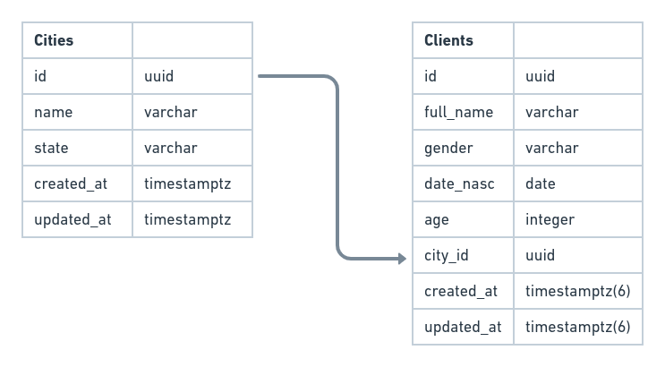

# Backend CP Node

## Descrição

Backend CP Node é uma API REST desenvolvida no intuito de avaliação de conhecimentos.

A API foi desenvolvida em NODE JS junto do framework Express, banco de dados PostgresSQL e Swagger para documentação.

Obs: A instalação do banco de dados está provido no arquivo docker-compose.dev que está na raiz do projeto.

## Relacionamento



## Instação e execução

- Clone o repositório:

```sh
  git clone https://github.com/Tharlys10/backend-cp-node.git && cd backend-cp-node
```

- Instale as depentencias

```sh
  yarn ou npm install
```

- Build a imagem do banco junto da imagem API

```sh
  docker-compose -f docker-compose.dev.yml build --force-rm --no-cache
```

- Levante os container

```sh
  docker-compose -f docker-compose.dev.yml up -d
```

- Rodando migrations

```sh
  yarn typeorm migration:run ou npm run typeorm migration:run
```

OBS: Para testar se tudo está funcionando basta acessar em seu navegador http://localhost:3333/api/docs irá aparacer a documentação no swagger;

## Testes

- Roda todos os teste

```sh
  yarn test ou npm run test
```

## Regras base

- [x] Cadastrar cidade;
- [x] Consultar cidade pelo nome;
- [x] Consultar cidade pelo estado;
- [x] Cadastrar cliente;
- [x] Consultar cliente pelo nome;
- [x] Consultar cliente pelo Id;
- [x] Remover cliente;
- [x] Alterar o nome do cliente;
